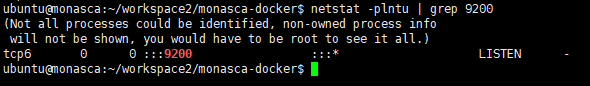
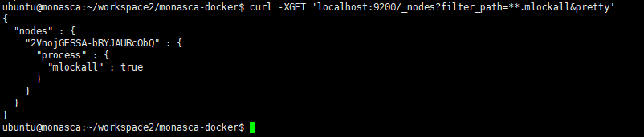
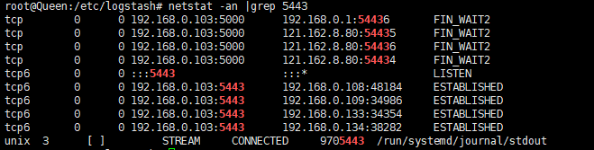

Monasca Server 설치 가이드
==========================

1. [개요](#1.)
    * [문서 목적](#1.1.)
    * [범위](#1.2.)
    * [참고자료](#1.3.)
2. [Pre-Requisite(전제조건)](#2.)
3. [MariaDB 설치 및 데이터베이스 설정](#3.)
4. [Apache Zookeeper 설치](#4.)
5. [Apache Kafka 설치](#5.)
6. [Apache Storm 설치](#6.)
7. [InfluxDB 설치](#7.)
8. [Monasca Persister 설치](#8.)
9. [Monasca Common 설치](#9.)
10. [Monasca Thresh 설치](#10.)
11. [Monasca Notification 설치](#11.)

12. [Monasca API 설치](#12.)
13. [Elasticsearch 관련 프로그램 설치](#13.)
    * [Elasticserarch 서버 설치](#13.1.)
    * [logstash 설치](#13.2.)
14. [Reference : Cross-Project(Tenant) 사용자 추가 및 권한 부여](#14.)
    
# 1.	개요  

# 1.1.	문서 목적  

본 문서(설치가이드)는, IaaS(Infrastructure as a Service) 중 하나인 Openstack 기반의 Cloud 서비스 상태 및 자원 정보, 그리고 VM Instance의 시스템 정보를 수집 및 관리하고, 사전에 정의한 Alarm 규칙에 따라 실시간으로 모니터링하여 관리자에게 관련 정보를 제공하기 위한 서버를 설치하는데 그 목적이 있다.
# 1.2.	범위  

본 문서의 범위는 Openstack 모니터링을 위한 오픈소스인 Monasca 제품군의 설치 및 관련
S/W(Kafka, Zookeeper, InfluxDB, MariaDB) 설치하기 위한 내용으로 한정되어 있다.
# 1.3.	참고자료  

https://wiki.openstack.org/wiki/Monasca
http://kafka.apache.org/quickstart (version: 2.9.2)
https://zookeeper.apache.org/doc/r3.3.4/zookeeperStarted.html
https://docs.influxdata.com/influxdb/v1.5/introduction/installation/
https://mariadb.org/mariadb-10-2-7-now-available/
https://github.com/monasca/monasca-docker

# 2.	Pre-Requisite(전제조건)  

- Monasca Server를 설치하기 위해서는 Bare Metal 서버 또는 Openstack 에서 생성한 Instance(Ubuntu 기준, Flavor - x1.large 이상)가 준비되어 있어야 한다.
- Openstack Cross-tenant 설정이 되어 있어야 한다.
 Reference : Cross-Project(Tenant) 사용자 추가 및 권한 부여 (openstack 기준)
- Monasca Server 설치에 필요한 프로그램 리스트 및 버전은 아래 사항을 참조한다.
- Monasca Server 를 설치하기에 필요한 프로그램을 사전에 설치한다.
- 설치 환경은 Ubuntu 18.04 , OpenStack Stein 기준으로 작성하였다.

※ 설치 프로그램 리스트 및 버전 참조 (순서) 
- INFLUXDB_VERSION=1.3.2-alpine
- INFLUXDB_INIT_VERSION=latest
- MYSQL_VERSION=5.5
- MYSQL_INIT_VERSION=1.5.1
- MEMCACHED_VERSION=1.5.0-alpine
- CADVISOR_VERSION=v0.26.1
- ZOOKEEPER_VERSION=3.4
   
※ 설치 전 사전에 설치되어 있어야 하는 프로그램 
- install git
<pre>    
    sudo apt-get update
    sudo apt-get install -y git      
</pre>

- install python
<pre>         
    sudo apt-get install python-keystoneclient
</pre>    
       

# 3.	docker 설치  

- Docker Key 등록
<pre>       
    $ sudo apt update
    $ sudo apt install apt-transport-https ca-certificates curl software-properties-common
    $ curl -fsSL https://download.docker.com/linux/ubuntu/gpg | sudo apt-key add –
</pre>     

- Docker repository 정보 등록
<pre>
    $ sudo add-apt-repository "deb [arch=amd64] https://download.docker.com/linux/ubuntu bionic stable
    $ sudo apt update
    $ apt-cache policy docker-ce
</pre>    
    
- Docker 설치
<pre>  
    $ sudo systemctl status docker
</pre> 

- Docker 설치 확인
<pre>  
    $ sudo apt install docker-ce
    ...
    docker.service - Docker Application Container Engine
    Loaded: loaded (/lib/systemd/system/docker.service; enabled; vendor preset: enabled)
    Active: active (running) since Mon 2019-06-17 01:40:41 UTC; 11s ago
       Docs: https://docs.docker.com
    Main PID: 3821 (dockerd)
      Tasks: 10
     CGroup: /system.slice/docker.service
               └─3821 /usr/bin/dockerd -H fd:/ --containerd=/run/containerd/containerd.sock
    ...
</pre>      
    
- Docker-Compose 설치
<pre>  
    $ sudo apt install docker-compose
</pre>     

# 4.	Monasca-Docker 설치  

- Openstack Keyston network route open
<pre>    
    $ sudo route add -net 172.31.30.0/24 gw 10.0.201.254
</pre>    
    
- Monasa-Docker 설치파일 다운로드
<pre>  
    $ mkdir workspace & cd workspace
    $ git clone https://github.com/monasca/monasca-docker.git
</pre>

- Monasa-Docker docker-compose.yml 파일 변경 
<pre>  
    $ cd monasca-docker
    $ vi docker-compose.yml
    ...
    version: '3'
    services:
    
      memcached:
        image: memcached:${MEMCACHED_VERSION}
        environment:
          LOGSTASH_FIELDS: "service=memcached"
    
      influxdb:
        image: influxdb:${INFLUXDB_VERSION}
        environment:
          LOGSTASH_FIELDS: "service=influxdb"
        ports:
          - "8086:8086"
      influxdb-init:
        image: monasca/influxdb-init:${INFLUXDB_INIT_VERSION}
        environment:
          LOGSTASH_FIELDS: "service=influxdb-init"
        depends_on:
          - influxdb
    
      # cadvisor will allow host metrics to be collected, but requires significant
      # access to the host system
      # if this is not desired, the following can be commented out, and the CADVISOR
      # environment variable should be set to "false" in the `agent-collector`
      # block - however no metrics will be collected
      cadvisor:
        image: google/cadvisor:${CADVISOR_VERSION}
        environment:
          LOGSTASH_FIELDS: "service=cadvisor"
        volumes:
          - "/:/rootfs:ro"
          - "/var/run:/var/run:rw"
          - "/sys:/sys:ro"
          - "/var/lib/docker:/var/lib/docker:ro"
    
      agent-forwarder:
        image: monasca/agent-forwarder:${MON_AGENT_FORWARDER_VERSION}
        environment:
          NON_LOCAL_TRAFFIC: "true"
          LOGSTASH_FIELDS: "service=monasca-agent-forwarder"
          OS_AUTH_URL: http://125.129.139.99:25000/v3
          OS_USERNAME: admin
          OS_PASSWORD: openstack
          OS_PROJECT_NAME: admin
        extra_hosts:
          - "monasca:192.168.0.103"
          - "control:192.168.56.103"
          - "compute:192.168.56.102"
          - "compute2:192.168.56.101"
          - "compute3:192.168.56.104"
    
      agent-collector:
        image: monasca/agent-collector:${MON_AGENT_COLLECTOR_VERSION}
        restart: on-failure
        environment:
          AGENT_HOSTNAME: "docker-host"
          FORWARDER_URL: "http://agent-forwarder:17123"
          CADVISOR: "true"
          CADVISOR_URL: "http://cadvisor:8080/"
          LOGSTASH_FIELDS: "service=monasca-agent-collector"
          MONASCA_MONITORING: "true"
          MONASCA_LOG_MONITORING: "false"
          OS_AUTH_URL: http://125.129.139.99:25000/v3
          OS_USERNAME: admin
          OS_PASSWORD: openstack
          OS_PROJECT_NAME: admin
        cap_add:
          - FOWNER
        volumes:
          - "/:/rootfs:ro"
        extra_hosts:
          - "control:<OPENSTACK_CONTROLL_NODE>"
          - "compute:<OPENSTACK_COMPUTE1_NODE>"
          - "compute2:<OPENSTACK_COMPUTE2_NODE>"
          - "compute3:<OPENSTACK_COMPUTE3_NODE>"
    
      alarms:
        image: monasca/alarms:${MON_ALARMS_VERSION}
        environment:
          LOGSTASH_FIELDS: "service=monasca-alarms"
          OS_AUTH_URL: http://<KEYSTON_IP>:25000/v3
          OS_USERNAME: <OS_USERNAME>
          OS_PASSWORD: <OS_PASSWORD>
          OS_PROJECT_NAME: <OS_PROJECT_NAME>
        depends_on:
    #      - keystone
          - monasca
        extra_hosts:
          - "control:<OPENSTACK_CONTROLL_NODE>"
          - "compute1:<OPENSTACK_COMPUTE1_NODE>"
          - "compute2:<OPENSTACK_COMPUTE2_NODE>"
          - "compute3:<OPENSTACK_COMPUTE3_NODE>"
    
      zookeeper:
        image: zookeeper:${ZOOKEEPER_VERSION}
        environment:
          LOGSTASH_FIELDS: "service=zookeeper"
        restart: on-failure
    
      kafka:
        image: monasca/kafka:${MON_KAFKA_VERSION}
        environment:
          KAFKA_DELETE_TOPIC_ENABLE: "true"
          LOGSTASH_FIELDS: "service=kafka"
        restart: on-failure
        depends_on:
          - zookeeper
      kafka-watcher:
        image: monasca/kafka-watcher:${MON_KAFKA_WATCHER_VERSION}
        environment:
          BOOT_STRAP_SERVERS: "kafka"
          PROMETHEUS_ENDPOINT: "0.0.0.0:8080"
          LOGSTASH_FIELDS: "service=kafka-watcher"
        depends_on:
          - kafka
        ports:
          - "18080:8080"
      kafka-init:
        image: monasca/kafka-init:${MON_KAFKA_INIT_VERSION}
        environment:
          ZOOKEEPER_CONNECTION_STRING: "zookeeper:2181"
          KAFKA_TOPIC_CONFIG: segment.ms=900000 # 15m
          KAFKA_CREATE_TOPICS: "\
            metrics:64:1,\
            alarm-state-transitions:12:1,\
            alarm-notifications:12:1,\
            retry-notifications:3:1,\
            events:12:1,\
            kafka-health-check:1:1,\
            60-seconds-notifications:3:1"
          LOGSTASH_FIELDS: "service=kafka-init"
        depends_on:
          - zookeeper
    
      mysql:
        image: mysql:${MYSQL_VERSION}
        environment:
          MYSQL_ROOT_PASSWORD: secretmysql
          LOGSTASH_FIELDS: "service=mysql"
        ports:
          - "3306:3306"
      mysql-init:
        image: monasca/mysql-init:${MYSQL_INIT_VERSION}
        environment:
          MYSQL_INIT_DISABLE_REMOTE_ROOT: "false"
          MYSQL_INIT_RANDOM_PASSWORD: "false"
          LOGSTASH_FIELDS: "service=mysql-init"
    
    #  keystone 부분 주석 처리
    #  keystone:
    #    image: monasca/keystone:${MON_KEYSTONE_VERSION}
    #    environment:
    #      KEYSTONE_HOST: keystone
    #      KEYSTONE_PASSWORD: secretadmin
    #      KEYSTONE_DATABASE_BACKEND: mysql
    #      KEYSTONE_MYSQL_HOST: mysql
    #      KEYSTONE_MYSQL_USER: keystone
    #      KEYSTONE_MYSQL_PASSWORD: keystone
    #      KEYSTONE_MYSQL_DATABASE: keystone
    #      LOGSTASH_FIELDS: "service=keystone"
    #    depends_on:
    #      - mysql
    #    ports:
    #      - "5001:5000"
    #      - "35357:35357"
    
      monasca-sidecar:
        image: timothyb89/monasca-sidecar:${MON_SIDECAR_VERSION}
        environment:
          LOGSTASH_FIELDS: "service=monasca-sidecar"
    
      monasca:
        image: monasca/api:${MON_API_VERSION}
        environment:
          SIDECAR_URL: http://monasca-sidecar:4888/v1/ingest
          LOGSTASH_FIELDS: "service=monasca-api"
          KEYSTONE_IDENTITY_URI: http://<KEYSTONE_IP>:25000/v3
          KEYSTONE_AUTH_URI: http://<KEYSTONE_IP>:25000/v3
          KEYSTONE_ADMIN_USER: <KEYSTONE_ADMIN_USER>
          KEYSTONE_ADMIN_PASSWORD: <KEYSTONE_ADMIN_PASSWORD>
        depends_on:
          - influxdb
    #      - keystone
          - mysql
          - zookeeper
          - kafka
          - monasca-sidecar
          - memcached
        ports:
          - "8070:8070"
        extra_hosts:
          - "control:<OPENSTACK_CONTROLL_NODE>"
          - "compute1:<OPENSTACK_COMPUTE1_NODE>"
          - "compute2:<OPENSTACK_COMPUTE2_NODE>"
          - "compute3:<OPENSTACK_COMPUTE3_NODE>"
    
      monasca-persister:
        image: monasca/persister:${MON_PERSISTER_VERSION}
        environment:
          LOGSTASH_FIELDS: "service=monasca-persister"
        restart: on-failure
        depends_on:
          - monasca
          - influxdb
          - zookeeper
          - kafka
    
      thresh:
        image: monasca/thresh:${MON_THRESH_VERSION}
        environment:
          NO_STORM_CLUSTER: "true"
          WORKER_MAX_HEAP_MB: "256"
          LOGSTASH_FIELDS: "service=monasca-thresh"
        depends_on:
          - zookeeper
          - kafka
    
      monasca-notification:
        image: monasca/notification:${MON_NOTIFICATION_VERSION}
        environment:
          NF_PLUGINS: "webhook"
          LOGSTASH_FIELDS: "service=monasca-notification"
          STATSD_HOST: monasca-statsd
          STATSD_PORT: 8125
        depends_on:
          - monasca
          - zookeeper
          - kafka
          - mysql
    
      grafana:
        image: monasca/grafana:${MON_GRAFANA_VERSION}
        environment:
          GF_AUTH_BASIC_ENABLED: "false"
          GF_USERS_ALLOW_SIGN_UP: "true"
          GF_USERS_ALLOW_ORG_CREATE: "true"
          GF_AUTH_KEYSTONE_ENABLED: "true"
          GF_AUTH_KEYSTONE_AUTH_URL: http://<KEYSTONE_IP>:25000
          GF_AUTH_KEYSTONE_VERIFY_SSL_CERT: "false"
          GF_AUTH_KEYSTONE_DEFAULT_DOMAIN: "Default"
          LOGSTASH_FIELDS: "service=grafana"
        ports:
          - "3000:3000"
        depends_on:
    #      - keystone
          - monasca
        extra_hosts:
           - "control:<OPENSTACK_CONTROLL_NODE>"
           - "compute1:<OPENSTACK_COMPUTE1_NODE>"
           - "compute2:<OPENSTACK_COMPUTE2_NODE>"
           - "compute3:<OPENSTACK_COMPUTE3_NODE>"
    
      grafana-init:
        image: monasca/grafana-init:${MON_GRAFANA_INIT_VERSION}
        environment:
          LOGSTASH_FIELDS: "service=grafana-init"
        depends_on:
          - grafana
    
      monasca-statsd:
        image: monasca/statsd:${MON_STATSD_VERSION}
        environment:
          FORWARDER_URL: http://agent-forwarder:17123
          LOG_LEVEL: WARN
        ports:
          - "8125/udp"

    ...
</pre>
    
- Monasca-Docker Server 설치 및 시작
<pre>    
    $ sudo docker-compose up -d
</pre>

# 5. Elasticserarch 서버 설치  

- dependencies 설치
<pre>    
    $ sudo apt-get update
    $ sudo apt-get install openjdk-8-jdk
</pre>

- Elasticsearch repository 등록
<pre>    
    $ wget -qO - https://artifacts.elastic.co/GPG-KEY-elasticsearch | sudo apt-key add -
    $ echo "deb https://artifacts.elastic.co/packages/5.x/apt stable main" | sudo tee -a /etc/apt/sources.list.d/elastic-5.x.list
</pre>

- Elasticsearch 설치
<pre>
    $ sudo apt-get update
    $ sudo apt-get install -y elasticsearch
</pre>     
    
- 사용자 그룹 추가 - Elasticsearch
<pre>    
    $ sudo usermod -a -G elasticsearch “사용자 계정”
</pre>        
    
- Elasticsearch configuration 파일 수정

<pre>    
    $ cd /etc/elasticsearch && sudo vi elasticsearch.yml
    ---
    ...
    # Lock the memory on startup:
    bootstrap.memory_lock: true
    ...
    # Set the bind address to a specific IP (IPv4 or IPv6):
    network.host: 0.0.0.0
    
    # Set a custom port for HTTP:
    http.port: 9200
    ...
</pre>
    
- Elasticsearch service 파일 수정

<pre>    
    $ sudo vi /usr/lib/systemd/system/elasticsearch.service
    ...
    # Specifies the maximum number of bytes of memory that may be locked into RAM
    # Set to "infinity" if you use the 'bootstrap.memory_lock: true' option
    # in elasticsearch.yml and 'MAX_LOCKED_MEMORY=unlimited' in /etc/default/elasticsearch
    LimitMEMLOCK=infinity
    ...
</pre>

- Elasticsearch default 파일 수정

<pre>
    $ sudo vi /etc/default/elasticsearch
    ...
    # The maximum number of bytes of memory that may be locked into RAM
    # Set to "unlimited" if you use the 'bootstrap.memory_lock: true' option
    # in elasticsearch.yml.
    # When using Systemd, the LimitMEMLOCK property must be set
    # in /usr/lib/systemd/system/elasticsearch.service
    MAX_LOCKED_MEMORY=unlimited
    ...
</pre>    

- Elasticsearch 서비스 시작
<pre>    
    $ sudo service elasticsearch start
</pre>
    
- Elasticserarch 서버 가동 여부 확인
<pre>    
    $ netstat -plntu | grep 9200
</pre>

- mlockall 정보가 “enabled” 되었는지 확인
<pre>    
    $ curl -XGET 'localhost:9200/_nodes?filter_path=**.mlockall&pretty'
</pre>

    

# 6.	logstash 설치  

- logstash 설치
<pre>    
    $ sudo apt-get install -y logstash
</pre>

- /etc/hosts 파일 수정
<pre>    
    $ sudo vi /etc/hosts
    ---
     ...
    “private network ip”  “hostname”
    ex) 192.168.0.103   host logstash elasticsearch
     ...
</pre>

- SSL certificate 파일 생성
<pre>
    $ cd /etc/logstash
    $ sudo openssl req -subj /CN=”hostaname” -x509 -days 3650 -batch -nodes -newkey rsa:4096 -keyout logstash.key -out logstash.crt
</pre>            

- filebeat-input.conf 파일 생성
<pre>
    $ cd /etc/logstash
    $ sudo vi conf.d/filebeat-input.conf
    ---
    ...
    input {
       beats {
         port => 5443
         type => syslog
         ssl => true
         ssl_certificate => "/etc/logstash/logstash.crt"
         ssl_key => "/etc/logstash/logstash.key"
       }
    }
    ...
</pre>

- syslog-filter.conf 파일 생성
<pre>
    $ cd /etc/logstash
    $ sudo vi conf.d/syslog-filter.conf
    ---
    ...
    filter {
          if [type] == "syslog" {
            grok {
              match => { "message" => "%{SYSLOGTIMESTAMP:syslog_timestamp} %{SYSLOGHOST:syslog_hostname} %{DATA:syslog_program}(?:\[%{POSINT:syslog_pid}\])?: %{GREEDYDATA:syslog_message}" }
              add_field => [ "received_at", "%{@timestamp}" ]
              add_field => [ "received_from", "%{host}" ]
            }
            date {
              match => [ "syslog_timestamp", "MMM  d HH:mm:ss", "MMM dd HH:mm:ss" ]
            }
          }
        }
    ...
</pre>

- output-elasticsearch.conf 파일 생성
<pre>
    $ cd /etc/logstash
    $ sudo vi conf.d/output-elasticsearch.conf
    ---
    ...
    output {
          elasticsearch { hosts => ["”your elastic ip”:9200"]    # 설치된 환경의 IP 정보
            hosts => "”your elastic ip”:9200"                 # 설치된 환경의 IP 정보
            manage_template => false
            index => "%{[@metadata][beat]}-%{+YYYY.MM.dd}"
            document_type => "%{[@metadata][type]}"
          }
        }    
    ...
</pre>

- logstash 서비스 시작
<pre>
    $ sudo service logstash start
</pre>

- logstash 서비스 확인
<pre>
    $ sudo service logstash start
</pre>

    
- Apache storm supervisor 서비스 시작 스크립트 생성
<pre>    
    $ sudo vi /etc/init/storm-supervisor.conf
    ---
    # Startup script for Storm Supervisor
    
    description "Storm Supervisor daemon"
    start on runlevel [2345]
    
    console log
    respawn
    
    kill timeout 240
    respawn limit 25 5
    
    setgid storm
    setuid storm
    chdir /opt/storm/
    exec /opt/storm/bin/storm supervisor
</pre>

- Apache storm nimbus 서비스 시작 스크립트 생성
<pre>
    $ sudo vi /etc/init/storm-nimbus.conf
    ---
    # Startup script for Storm Nimbus
    
    description "Storm Nimbus daemon"
    start on runlevel [2345]
    
    console log
    respawn
    
    kill timeout 240
    respawn limit 25 5
    
    setgid storm
    setuid storm
    chdir /opt/storm/
    exec /opt/storm/bin/storm nimbus
</pre>    

- apache storm 설정 파일 수정
<pre>
    $ sudo vi /opt/storm/conf/storm.yaml
    # 아래 사항을 추가한다.
    ---
    ### base
    java.library.path: "/usr/local/lib:/opt/local/lib:/usr/lib"
    storm.local.dir: "/var/storm"
    
    ### zookeeper.*
    storm.zookeeper.servers:
        - "localhost"
    storm.zookeeper.port:  2181
    storm.zookeeper.retry.interval: 5000
    storm.zookeeper.retry.times: 29
    storm.zookeeper.root: "/storm"
    storm.zookeeper.session.timeout: 30000
    
    ### supervisor.* configs are for node supervisors
    supervisor.slots.ports:
        - 6701
        - 6702
        - 6703
        - 6704
    supervisor.childopts: "-Xmx1024m"
    
    ### worker.* configs are for task workers
    worker.childopts: "-Xmx1280m -XX:+UseConcMarkSweepGC -Dcom.sun.management.jmxremote"
    
    ### nimbus.* configs are for the masteri
    nimbus.host: "localhost"
    nimbus.thrift.port: 6627
    mbus.childopts: "-Xmx1024m"
    
    ### ui.* configs are for the master
    ui.host: 127.0.0.1
    ui.port: 8078
    ui.childopts: "-Xmx768m"
    
    ### drpc.* configs
    
    ### transactional.* configs
    transactional.zookeeper.servers:
        - "localhost"
    transactional.zookeeper.port: 2181
    transactional.zookeeper.root: "/storm-transactional"
    
    ### topology.* configs are for specific executing storms
    topology.acker.executors: 1
    topology.debug: false
    
    logviewer.port: 8077
    logviewer.childopts: "-Xmx128m"
</pre>
    
- apache storm 사용자 및 필요한 디렉토리 설정
<pre>
    $ sudo useradd storm -U -r    
    $ sudo mkdir /var/storm
    $ sudo mkdir /opt/storm/logs
    $ sudo chown -R storm. /var/storm
    $ sudo chown -R storm. /opt/storm/logs
</pre>
    
- apache storm 서비스 시작
<pre>
    $ sudo service storm-nimbus start
    $ sudo service storm-supervisor start
</pre>        
    
- 확인
<pre>
    $ sudo tail -5f /var/log/upstart/storm-nimbus.log
    --- 아래와 같이 정상적인 로그가 보인다면 성공 ---
    
    Running: java -server -Ddaemon.name=nimbus -Dstorm.options= -Dstorm.home=/opt/storm -Dstorm.log.dir=/opt/storm/logs -Djava.library.path=/usr/local/lib:/opt/local/lib:/usr/lib -Dstorm.conf.file= -cp /opt/storm/lib/minlog-1.3.0.jar:/opt/storm/lib/servlet-api-2.5.jar:/opt/storm/lib/storm-rename-hack-1.0.0.jar:/opt/storm/lib/log4j-core-2.1.jar:/opt/storm/lib/asm-5.0.3.jar:/opt/storm/lib/storm-core-1.0.0.jar:/opt/storm/lib/log4j-api-2.1.jar:/opt/storm/lib/kryo-3.0.3.jar:/opt/storm/lib/slf4j-api-1.7.7.jar:/opt/storm/lib/clojure-1.7.0.jar:/opt/storm/lib/log4j-over-slf4j-1.6.6.jar:/opt/storm/lib/log4j-slf4j-impl-2.1.jar:/opt/storm/lib/disruptor-3.3.2.jar:/opt/storm/lib/reflectasm-1.10.1.jar:/opt/storm/lib/objenesis-2.1.jar:/opt/storm/conf -Xmx1024m -Dlogfile.name=nimbus.log -DLog4jContextSelector=org.apache.logging.log4j.core.async.AsyncLoggerContextSelector -Dlog4j.configurationFile=/opt/storm/log4j2/cluster.xml org.apache.storm.daemon.nimbus
    
    $ sudo tail -5f /var/log/upstart/storm-supervisor.log
    --- 아래와 같이 정상적인 로그가 보인다면 성공 ---
    
    Running: java -server -Ddaemon.name=supervisor -Dstorm.options= -Dstorm.home=/opt/storm -Dstorm.log.dir=/opt/storm/logs -Djava.library.path=/usr/local/lib:/opt/local/lib:/usr/lib -Dstorm.conf.file= -cp /opt/storm/lib/minlog-1.3.0.jar:/opt/storm/lib/servlet-api-2.5.jar:/opt/storm/lib/storm-rename-hack-1.0.0.jar:/opt/storm/lib/log4j-core-2.1.jar:/opt/storm/lib/asm-5.0.3.jar:/opt/storm/lib/storm-core-1.0.0.jar:/opt/storm/lib/log4j-api-2.1.jar:/opt/storm/lib/kryo-3.0.3.jar:/opt/storm/lib/slf4j-api-1.7.7.jar:/opt/storm/lib/clojure-1.7.0.jar:/opt/storm/lib/log4j-over-slf4j-1.6.6.jar:/opt/storm/lib/log4j-slf4j-impl-2.1.jar:/opt/storm/lib/disruptor-3.3.2.jar:/opt/storm/lib/reflectasm-1.10.1.jar:/opt/storm/lib/objenesis-2.1.jar:/opt/storm/conf -Xmx1024m -Dlogfile.name=supervisor.log -DLog4jContextSelector=org.apache.logging.log4j.core.async.AsyncLoggerContextSelector -Dlog4j.configurationFile=/opt/storm/log4j2/cluster.xml org.apache.storm.daemon.supervisor    
</pre>
    
# 7.	InfluxDB 설치  

- influxDB repository 등록
<pre>
    $ sudo apt-get update
    
    $ curl -sL https://repos.influxdata.com/influxdb.key | sudo apt-key add -
    
    $ echo "deb https://repos.influxdata.com/ubuntu trusty stable" | sudo tee /etc/apt/sources.list.d/influxdb.list
</pre>

- influxDB 및 관련 dependencies 설치
<pre>  
    $ sudo apt-get update
    $ sudo apt-get install -y influxdb
    $ sudo apt-get install -y apt-transport-https
</pre>

- influxDB 서비스 시작
<pre>
    $  sudo service influxdb start
</pre>
    
- 메트릭스 관련 데이터베이스 생성 및 정책 등록
<pre>
    $  influx
    Connected to http://localhost:8086 version 1.3.1
    InfluxDB shell version: 1.3.1
    > CREATE DATABASE mon
    > CREATE USER monasca WITH PASSWORD 'password'
    > CREATE RETENTION POLICY persister_all ON mon DURATION 90d REPLICATION 1 DEFAULT
    > quit
    
# Alarm 관련 정보를 관리하기 위한 데이터베이스 생성 및 관리자 정보 등록
</pre>

- 확인
<pre>
    $  influx -username monasca -password “password”
    Connected to http://localhost:8086 version 1.3.1
    InfluxDB shell version: 1.3.1
    > show databases
    name: databases
    name
    ----
    mon
    _internal
</pre>
    
# 8.	Monasca Persister 설치  

- monasca persister 설치
<pre>  
    $ sudo pip install --upgrade pbr
    $ sudo pip install influxdb
    $ sudo pip install git+https://git.openstack.org/openstack/monasca-persister@1.6.0#egg=monasca-persister
</pre>
    
- persister 사용자 정보 및 디렉토리 등록
<pre>   
    $ sudo groupadd --system monasca
    $ sudo useradd --system --gid monasca monasca
    $ sudo mkdir -p /var/lib/monasca-persister
    $ sudo mkdir -p /var/log/monasca/persister
    $ sudo chown monasca:monasca /var/lib/monasca-persister
    $ sudo chown monasca:monasca /var/log/monasca/persister
    $ sudo chown root:monasca /etc/monasca/persister.conf
    $ sudo chmod 640 /etc/monasca/persister.conf
</pre>    

- configuration 파일 생성
<pre>  
    $ sudo vi /etc/monasca/persister.conf
    ---
    [DEFAULT]
    log_config_append=/etc/monasca/persister-logging.conf   # Log Level지정
    
    [repositories]
    # The driver to use for the metrics repository
    metrics_driver = monasca_persister.repositories.influxdb.metrics_repository:MetricInfluxdbRepository
    #metrics_driver = monasca_persister.repositories.cassandra.metrics_repository:MetricCassandraRepository
    
    # The driver to use for the alarm state history repository
    alarm_state_history_driver = monasca_persister.repositories.influxdb.alarm_state_history_repository:AlarmStateHistInfluxdbRepository
    #alarm_state_history_driver = monasca_persister.repositories.cassandra.alarm_state_history_repository:AlarmStateHistCassandraRepository
    
    [zookeeper]
    # Comma separated list of host:port
    uri = localhost:2181
    partition_interval_recheck_seconds = 15
    
    [kafka_alarm_history]
    # Comma separated list of Kafka broker host:port.
    uri = localhost:9092
    group_id = 1_alarm-state-transitions
    topic = alarm-state-transitions
    consumer_id = consumers
    client_id = 1
    database_batch_size = 1000
    max_wait_time_seconds = 30
    # The following 3 values are set to the kakfa-python defaults
    fetch_size_bytes = 4096
    buffer_size = 4096
    # 8 times buffer size
    max_buffer_size = 32768
    # Path in zookeeper for kafka consumer group partitioning algo
    zookeeper_path = /persister_partitions/alarm-state-transitions
    num_processors = 3
    
    [kafka_metrics]
    # Comma separated list of Kafka broker host:port
    uri = localhost:9092
    group_id = 1_metrics
    topic = metrics
    consumer_id = consumers
    client_id = 1
    database_batch_size = 1000
    max_wait_time_seconds = 30
    # The following 3 values are set to the kakfa-python defaults
    fetch_size_bytes = 4096
    buffer_size = 4096
    # 8 times buffer size
    max_buffer_size = 32768
    # Path in zookeeper for kafka consumer group partitioning algo
    zookeeper_path = /persister_partitions/metrics
    num_processors = 1
    
    [influxdb]
    database_name = mon                           # influxdb 데이터베이스 정보
    ip_address = localhost                           # influxdb 접속 아이피
    port = 8086                                     # influxdb 접속 포트
    user = monasca                                 # influxdb 사용자 아이디
    password = password                            # influxdb 사용자 패스워드
</pre>
    
- monasca persister 시작 스크립트 작성
<pre>
    $ sudo vi /etc/init/monasca-persister.conf
    ---
    # Startup script for the Monasca Persister
    description "Monasca Persister Java app"
    start on runlevel [2345]
    
    console log
    respawn
    
    script
      monasca-persister \
      --config-file /etc/monasca/persister.conf
    end script
</pre>
    
- monasca persister 시작
<pre>
    $ sudo service monasca-persister start
</pre>    
    
- 확인
<pre>  
    $ ps -ef |grep monasca-persister
</pre>    

    
# 9.	Monasca Common 설치  

- monasca common 다운로드
<pre>    
    $ git clone -b 2.0.0 https://github.com/openstack/monasca-common
    $ cd monasca-common
</pre>    
    
- monasca common 오픈소스 compile and package
<pre>        
    $ cd java
    $ mvn clean install
</pre>    
    
- 확인
<pre>
    # maven repository에 monasca-common-1.2.1-SNAPSHOPT 이 생성된 것을 확인한다.
</pre>    
    
# 10.	Monasca Thresh 설치  

- monasca thresh 다운로드
<pre>    
    $ git clone -b 1.4.0 https://github.com/openstack/monasca-thresh
    $ cd monasca-thresh
</pre>
        
- monasca thresh 오픈소스 compile and package
<pre>
    $ ./run_maven.sh 1.2.1-SNAPSHOT clean package
</pre>    
    
- 생성된 monasca thresh package 압축해제 및 configuration 파일 수정
<pre>  
    $ cd target
    
    # 생성된 monasca-thres package 파일명에 생성일자가 있어 압축해제 명령어가 실행되지 않는다.
    # 생성된 package 명을 monasca-thresh-2.1.1-SNAPSHOT.tar.gz 로 변경한다.
    $ mv  monasca-thresh-2.1.1-SNAPSHOT-2017-xx-xxT00:20:08-5c1fd5-tar.tar.gz monasca-thresh-2.1.1-SNAPSHOT.tar.gz
    
    $ tar xvzf monasca-thresh-2.1.1-SNAPSHOT.tar.gz
    
    # 압축해제된 디렉토리도 위와 같이 변경한다.
    $ mv  monasca-thresh-2.1.1-SNAPSHOT-2017-xx-xxT00:20:08-5c1fd5 monasca-thresh-2.1.1-SNAPSHOT
    $ cd monasca-thresh-2.1.1-SNAPSHOT
    $ cd examples
    $ mv thresh-config.yml-sample thresh-config.yml
    $ vi thresh-config.yml
    ---
    metricSpoutThreads: 2
    metricSpoutTasks: 2
    
    statsdConfig:
      host: localhost
      port: 8125
      prefix: monasca.storm.
      dimensions: !!map
        service : monitoring
        component : storm
    
    
    metricSpoutConfig:
      kafkaConsumerConfiguration:
      # See http://kafka.apache.org/documentation.html#api for semantics and defaults.
        topic: metrics
        numThreads: 1
        groupId: thresh-metric
        zookeeperConnect: localhost:2181
        consumerId: 1
        socketTimeoutMs: 30000
        socketReceiveBufferBytes : 65536
        fetchMessageMaxBytes: 1048576
        autoCommitEnable: true
        autoCommitIntervalMs: 60000
        queuedMaxMessageChunks: 10
        rebalanceMaxRetries: 4
        fetchMinBytes:  1
        fetchWaitMaxMs:  100
        rebalanceBackoffMs: 2000
        refreshLeaderBackoffMs: 200
        autoOffsetReset: largest
        consumerTimeoutMs:  -1
        clientId : 1
        zookeeperSessionTimeoutMs : 60000
        zookeeperConnectionTimeoutMs : 60000
        zookeeperSyncTimeMs: 2000
    
    
    eventSpoutConfig:
      kafkaConsumerConfiguration:
      # See http://kafka.apache.org/documentation.html#api for semantics and defaults.
        topic: events
        numThreads: 1
        groupId: thresh-event
        zookeeperConnect: localhost:2181
        consumerId: 1
        socketTimeoutMs: 30000
        socketReceiveBufferBytes : 65536
        fetchMessageMaxBytes: 1048576
        autoCommitEnable: true
        autoCommitIntervalMs: 60000
        queuedMaxMessageChunks: 10
        rebalanceMaxRetries: 4
        fetchMinBytes:  1
        fetchWaitMaxMs:  100
        rebalanceBackoffMs: 2000
        refreshLeaderBackoffMs: 200
        autoOffsetReset: largest
        consumerTimeoutMs:  -1
        clientId : 1
        zookeeperSessionTimeoutMs : 60000
        zookeeperConnectionTimeoutMs : 60000
        zookeeperSyncTimeMs: 2000
    
    
    kafkaProducerConfig:
      # See http://kafka.apache.org/documentation.html#api for semantics and defaults.
      topic: alarm-state-transitions
      metadataBrokerList: localhost:9092
      serializerClass: kafka.serializer.StringEncoder
      partitionerClass:
      requestRequiredAcks: 1
      requestTimeoutMs: 10000
      producerType: sync
      keySerializerClass:
      compressionCodec: none
      compressedTopics:
      messageSendMaxRetries: 3
      retryBackoffMs: 100
      topicMetadataRefreshIntervalMs: 600000
      queueBufferingMaxMs: 5000
      queueBufferingMaxMessages: 10000
      queueEnqueueTimeoutMs: -1
      batchNumMessages: 200
      sendBufferBytes: 102400
      clientId : Threshold_Engine
    
    
    sporadicMetricNamespaces:
      - foo
    
    database:
      driverClass: com.mysql.jdbc.Driver
      url: jdbc:mysql://localhost/mon?useSSL=true                # mysql 접속 정보
      user: monasca                                           # mysql 사용자 아이디
      password: password                                      # mysql 사용자 패스워드
      properties:
          ssl: false
      # the maximum amount of time to wait on an empty pool before throwing an exception
      maxWaitForConnection: 1s
    
      # the SQL query to run when validating a connection's liveness
      validationQuery: "/* MyService Health Check */ SELECT 1"
    
      # the minimum number of connections to keep open
      minSize: 8
    
      # the maximum number of connections to keep open
    
    
      maxSize: 41
</pre>
      
- monasca thresh configuration 및 package 파일 이동
<pre>
    $ sudo mv thresh-config.yml /etc/monasca/
    $ cd ..
    $ mv monasca-thresh.jar /etc/monasca/
</pre>    
    
- monasca thresh 서비스 시작 스크립트 생성
<pre>                  
    $ sudo vi /etc/init.d/monasca-thresh
    ---
    #!/bin/bash
    #
    # (C) Copyright 2015 Hewlett Packard Enterprise Development Company LP
    #
    # Licensed under the Apache License, Version 2.0 (the "License");
    # you may not use this file except in compliance with the License.
    # You may obtain a copy of the License at
    #
    #    http://www.apache.org/licenses/LICENSE-2.0
    #
    # Unless required by applicable law or agreed to in writing, software
    # distributed under the License is distributed on an "AS IS" BASIS,
    # WITHOUT WARRANTIES OR CONDITIONS OF ANY KIND, either express or
    # implied.
    # See the License for the specific language governing permissions and
    # limitations under the License.
    #
    
    ### BEGIN INIT INFO
    # Provides:          monasca-thresh
    # Required-Start:    $nimbus
    # Required-Stop:
    # Default-Start:     2 3 4 5
    # Default-Stop:
    # Short-Description: Monitoring threshold engine running under storm
    # Description:
    ### END INIT INFO
    
    case "$1" in
        start)
          $0 status
          if [ $? -ne 0 ]; then
            sudo -Hu monasca /opt/storm/bin/storm jar /etc/monasca/monasca-thresh.jar monasca.thresh.ThresholdingEngine /etc/monasca/thresh-config.yml thresh-cluster
            exit $?
          else
            echo "monasca-thresh is already running"
            exit 0
          fi
        ;;
        stop)
          # On system shutdown storm is being shutdown also and this will hang so skip shutting down thresh in that case
          if [ -e '/sbin/runlevel' ]; then  # upstart/sysV case
            if [ $(runlevel | cut -d\  -f 2) == 0 ]; then
              exit 0
            fi
          else  # systemd case
            systemctl list-units --type=target |grep shutdown.target
            if [ $? -eq 0 ]; then
              exit 0
            fi
          fi
          sudo -Hu monasca /opt/storm/bin/storm kill thresh-cluster
          # The above command returns but actually takes awhile loop watching status
          while true; do
            sudo -Hu monasca /opt/storm/bin/storm list |grep thresh-cluster
            if [ $? -ne 0 ]; then break; fi
            sleep 1
          done
        ;;
        status)
            sudo -Hu monasca /opt/storm/bin/storm list |grep thresh-cluster
        ;;
        restart)
          $0 stop
          $0 start
        ;;
    esac
</pre>

- monasca thresh 서비스 시작
<pre>
    $ sudo chmod +x /etc/init.d/monasca-thresh
    $ sudo service monasca-thresh start
</pre>    
    
- 확인
<pre>
    $ ps -ef |grep thresh
</pre>           
    
        
# 11.	Monasca Notification 설치  

- monasca notification 및 dependencies 설치
<pre>
    $ sudo pip install git+https://github.com/openstack/monasca-notification@1.9.0
    $ sudo apt-get install sendmail
</pre>        
    
- monasca notificatioin 설정 파일 생성
<pre>
    $ sudo vi /etc/monasca/notification.yaml
    ---
    kafka:
        url: 127.0.0.1:9092  # or comma seperated list of multiple hosts
        group: monasca-notification
        alarm_topic: alarm-state-transitions
        notification_topic: alarm-notifications
        notification_retry_topic: retry-notifications
        periodic:
            60: 60-seconds-notifications
    
        max_offset_lag: 600  # In seconds, undefined for none
    
    database:
      repo_driver: monasca_notification.common.repositories.mysql.mysql_repo:MysqlRepo
    
    mysql:
      host: 127.0.0.1                                         # mysql 접속 IP
      port: 3306                                             # mysql 접속 port
      user: monasca                                         # mysql 사용자 아이디
      passwd: password                                      # mysql 사용자 패스워드
      db: mon                                               # mysql database 이름
      # A dictionary set according to the params defined in, http://dev.mysql.com/doc/refman/5.0/en/mysql-ssl-set.html
      #    ssl: {'ca': '/path/to/ca'}
    
    notification_types:
        email:
            server: 127.0.0.1
            port: 25
            user: 
            password: 
            timeout: 60
            from_addr: ihocho@crossent.com
    
        webhook:
            timeout: 5
    
    processors:
        alarm:
            number: 2
            ttl: 14400  # In seconds, undefined for none. Alarms older than this are not processed
        notification:
            number: 4
    
    retry:
        interval: 30
        max_attempts: 5
    
    queues:
        alarms_size: 256
        finished_size: 256
        notifications_size: 256
        sent_notifications_size: 50  # limiting this size reduces potential # of re-sent notifications after a failure
    
    zookeeper:
        url: 127.0.0.1:2181  # or comma seperated list of multiple hosts
        notification_path: /notification/alarms
        notification_retry_path: /notification/retry
        periodic_path:
            60: /notification/60_seconds
    
    logging: # Used in logging.dictConfig
        version: 1
        disable_existing_loggers: False
        formatters:
            default:
                format: "%(asctime)s %(levelname)s %(name)s %(message)s"
        handlers:
            console:
                class: logging.StreamHandler
                formatter: default
            file:
                class : logging.handlers.RotatingFileHandler
                filename: /var/log/monasca/notification/notification.log 
                formatter: default
                maxBytes: 10485760  # Rotate at file size ~10MB
                backupCount: 5  # Keep 5 older logs around
        loggers:
            kazoo:
                level: WARN
            kafka:
                level: WARN
            statsd:
                level: WARN
        root:
            handlers:
                [console, file]
    #            - file
            level: WARN
    statsd:
        host: 'localhost'
        port: 8125
</pre>
            
- monasca notification 시작 스크립트 생성
<pre>   
    $ sudo vi /etc/init/monasca-notification.conf
    ---
    # Startup script for the monasca_notification
    
    description "Monasca Notification daemon"
    start on runlevel [2345]
    
    console log
    respawn
    
    setgid monasca
    setuid monasca
    exec /usr/bin/python /usr/local/bin/monasca-notification
</pre>
    
- monasca notification 로그 디렉토리 생성
<pre>   
    $ sudo mkdir -p /var/log/monasca/notification
    $ sudo chown -R monasca. /var/log/monasca/notification
</pre>
    
- monasca notification 서비스 가동
<pre>
    $ sudo service monasca-notification start
</pre>    
    
- 확인
<pre>
    $ ps -ef |grep notification
</pre>
    

# 12.	Monasca API 설치  

- monasca api 다운로드
<pre>   
    $ git clone -b 2.0.0 https://github.com/openstack/monasca-api
    $ cd monasca-api
</pre>     
    
- run_maven.sh 파일 수정
<pre>    
    ---
    #!/bin/bash
    set -x
    env
    # Download maven 3 if the system maven isn't maven 3
    VERSION=`mvn -v | grep "Apache Maven 3"`
    if [ -z "${VERSION}" ]; then
       curl http://archive.apache.org/dist/maven/binaries/apache-maven-3.2.1-bin.tar.gz > apache-maven-3.2.1-bin.tar.gz
       tar -xvzf apache-maven-3.2.1-bin.tar.gz
       MVN=${PWD}/apache-maven-3.2.1/bin/mvn
    else
       MVN=mvn
    fi
    
    # Get the expected common version
    COMMON_VERSION=$1
    # Get rid of the version argument
    shift
    
    # Get rid of the java property name containing the args
    shift
    
    RUN_BUILD=false
    for ARG in $*; do
       if [ "$ARG" = "package" ]; then
           RUN_BUILD=true
       fi
       if [ "$ARG" = "install" ]; then
           RUN_BUILD=true
       fi
    done
    
    if [ $RUN_BUILD = "true" ]; then
        if [ ! -z "$ZUUL_BRANCH" ]; then
            BRANCH=${ZUUL_BRANCH}
        else
            BRANCH=${ZUUL_REF}
        fi
    
        ( cd common; ./build_common.sh ${MVN} ${COMMON_VERSION} 2.0.0 )
        RC=$?
        if [ $RC != 0 ]; then
            exit $RC
        fi
    fi
    
    # Invoke the maven 3 on the real pom.xml
    ( cd java; ${MVN} -Dmaven.test.skip=true -DgitRevision=`git rev-list HEAD --max-count 1 --abbrev=0 --abbrev-commit` $* )
    
    RC=$?
    
    # Copy the jars where the publisher will find them
    if [ $RUN_BUILD = "true" ]; then
       if [ ! -L target ]; then
          ln -sf java/target target
       fi
    fi
    
    rm -fr apache-maven-3.2.1*
    exit $RC
</pre>
    
- common/build_common.sh 파일 수정
<pre>    
    ---
    #!/bin/sh
    set -x
    ME=`whoami`
    echo "Running as user: $ME"
    MVN=$1
    VERSION=$2
    BRANCH=$3
    
    check_user() {
        ME=$1
        if [ "${ME}" != "jenkins" ]; then
           echo "\nERROR: Download monasca-common and do a mvn install to install the monasca-commom jars\n" 1>&2
           exit 1
        fi
    }
    
    BUILD_COMMON=false
    POM_FILE=~/.m2/repository/monasca-common/monasca-common/${VERSION}/monasca-common-${VERSION}.pom
    if [ ! -r "${POM_FILE}" ]; then
        check_user ${ME}
        BUILD_COMMON=true
    fi
    
    # This should only be done on the stack forge system
    if [ "${BUILD_COMMON}" = "true" ]; then
       git clone -b ${BRANCH} https://git.openstack.org/openstack/monasca-common
       cd monasca-common
       ${MVN} clean
       ${MVN} install -Dmaven.test.skip=true
    fi
</pre>
    
- monasca api 소스 compile & package
<pre>
    $ ./run_maven.sh 1.2.1-SNAPSHOT clean package
</pre>    
    
- monasca api package 파일 압축 해제 및 configuration 파일 수정
<pre>    
    $ cd target
    $ tar xvzf monasca-api-1.2.1-SNAPSHOT-tar.tar.gz
    $ cd monasca-api-1.2.1-SNAPSHOT/
    $ cd examples
    $ mv api-config.yml-sample api-config.yml
    $ vi api-config.yml
    ---
    # The region for which all metrics passing through this server will be persisted
    region: RegionOne	# Region 이름
    
    # Maximum rows (Mysql) or points (Influxdb) to return when listing elements
    maxQueryLimit: 10000
    
    # Whether this server is running on a secure port
    accessedViaHttps: false
    
    # Topic for publishing metrics to
    metricsTopic: metrics
    
    # Topic for publishing domain events to
    eventsTopic: events
    
    validNotificationPeriods:
      - 60
    
    kafka:
      brokerUris:
        - localhost:9092                            # kafka 접속 정보
      zookeeperUris:
        - localhost:2181                            # zookeeper 접속 정보
      healthCheckTopic: healthcheck
    
    mysql:
      driverClass: com.mysql.jdbc.Driver
      url: jdbc:mysql://localhost:3306/mon?connectTimeout=5000&autoReconnect=true&useLegacyDatetimeCode=false                                  # mysql 접속 정보
      user: monasca                                # mysql 사용자 아이디
      password: password                           # mysql 사용자 패스워드
      maxWaitForConnection: 1s
      validationQuery: "/* MyService Health Check */ SELECT 1"
      minSize: 8
      maxSize: 32
      checkConnectionWhileIdle: false
      checkConnectionOnBorrow: true
    
    databaseConfiguration:
      databaseType: influxdb
    
    influxDB:
      version: V9
      maxHttpConnections: 100
      # Retention policy may be left blank to indicate default policy.
      retentionPolicy:
      name: mon                                            # influxdb database 이름
      url: http://localhost:8086                               # influxdb http 접속 정보
      user: monasca                                         # influxdb 사용자 아이디
      password: password                                    # influxdb 사용자 패스워드
    
    vertica:
      driverClass: com.vertica.jdbc.Driver
      url: jdbc:vertica://192.168.10.8/mon
      user: dbadmin
      password: password
      maxWaitForConnection: 1s
      validationQuery: "/* MyService Health Check */ SELECT 1"
      minSize: 4
      maxSize: 32
      checkConnectionWhileIdle: false
      #
      # vertica database hint to be added to SELECT
      # statements.  For example, the hint below is used
      # to tell vertica that the query can be satisfied
      # locally (replicated projection).
      #
      # dbHint: "/*+KV(01)*/"
      dbHint: ""
    
    middleware:
      enabled: true
      serverVIP: xxx.xxx.xxx.xxx                                    #keystone ip 정보
      serverPort: 35357                                            #keystone 인증 port
      useHttps: false
      truststore: "None"
      truststorePassword: "None"
      connTimeout: 500
      connSSLClientAuth: false 
      keystore: "None"
      keystorePassword: false
      connPoolMaxActive: 3
      connPoolMaxIdle: 3
      connPoolEvictPeriod: 600000
      connPoolMinIdleTime: 600000
      connRetryTimes: 2
      connRetryInterval: 50
      defaultAuthorizedRoles: [admin, user, domainuser, domainadmin, monasca-user]
      readOnlyAuthorizedRoles: [admin, monasca-read-only-user]      
      agentAuthorizedRoles: [monitoring-delegate]                   #cross-tenant role 정보
      adminAuthMethod: password                                  #사용자 인증 방식
      adminUser: monasca-agent                                    #cross-tenant 사용자 아이디
      adminPassword: cfmonit                                       #cross-tenant 사용자 패스워드
      adminProjectId: 9c1a27e20412473b843dbf32bdec2390           #관리 Project guid 정보
      adminProjectName: "admin"                                     #관리 Project 이름
      adminUserDomainId: 9c6e016d8b3642109655740c26e5eb57      #domain guid 정보
      adminUserDomainName: 9c6e016d8b3642109655740c26e5eb57  #domain guid 정보
      adminProjectDomainId:
      adminProjectDomainName:
      adminToken:
      timeToCacheToken: 600
      maxTokenCacheSize: 1048576
    
    server:
      applicationConnectors:
        - type: http
          port: 8020                    # monasca api listen port
          maxRequestHeaderSize: 16KiB  # Allow large headers used by keystone tokens
      requestLog:
       timeZone: UTC
       appenders:
        - type: file
          currentLogFilename: /var/log/monasca/api/request.log
          threshold: ALL
          archive: true
          archivedLogFilenamePattern: /var/log/monasca/api/request-%d.log.gz
          archivedFileCount: 5
    
    # Logging settings.
    logging:
    
      # The default level of all loggers. Can be OFF, ERROR, WARN, INFO, DEBUG, TRACE, or ALL.
      level: WARN                                       # 로그 레벨 설정
    
      # Logger-specific levels.
      loggers:
    
        # Sets the level for 'com.example.app' to DEBUG.
        com.example.app: DEBUG
    
      appenders:
        - type: console
          threshold: ALL
          timeZone: UTC
          target: stdout
          logFormat: # TODO
    
        - type: file
          currentLogFilename: /var/log/monasca/api/monasca-api.log
          threshold: ALL
          archive: true
          archivedLogFilenamePattern: /var/log/monasca/api/monasca-api-%d.log.gz
          archivedFileCount: 5
          timeZone: UTC
          logFormat: # TODO
    
        - type: syslog
          host: localhost
          port: 514
          facility: local0
          threshold: ALL        
</pre>

- monasca api package 파일 및 configuration 파일 이동 (optional)
<pre>
    # 다음 단계 monasca api 서비스 시작 스크립트에서 참조하는 monasca-api.jar 및 api-config.yml 파일의 위치를 관리하기 손쉬운 곳으로 이동시킨다.
    
    $ mv ~/where-at-monasca-api-directory/target/monasca-api-1.2.1-SNAPSHOT/monasca-api.jar ~/monasca-api/
    $ mv ~/where-at-monasca-api-directory/target/monasca-api-1.2.1-SNAPSHOT/examples/api-config.yml ~/monasca-api/
</pre>        
    
- monasca api 서비스 시작 스크립트 생성
<pre>    
    $ sudo vi /etc/init/monasca-api.conf
    ---
    # Startup script for the monasca_api
    description "Monasca Notification daemon"
    start on runlevel [2345]
    
    console log
    respawn
    
    setgid monasca
    setuid monasca
    exec java -jar /home/ubuntu/monasca-api/monasca-api.jar server /home/ubuntu/monasca-api/api-config.yml
</pre>

- monasca api 서비스 시작
<pre>    
    $ sudo service monasca-api start
</pre>    
    
- 확인
<pre>    
    $ netstat -an |grep LISTEN
</pre>    
        

# 13.	Elasticsearch 관련 프로그램 설치  

# 13.1.	Elasticserarch 서버 설치  

- dependencies 설치
<pre>           
    $ sudo apt-get update
    $ sudo apt-get install -y python-software-properties software-properties-common
</pre>         
        
- Elasticsearch repository 등록
<pre>  
    $ wget -qO - https://artifacts.elastic.co/GPG-KEY-elasticsearch | sudo apt-key add -
    $ echo "deb https://artifacts.elastic.co/packages/5.x/apt stable main" | sudo tee -a /etc/apt/sources.list.d/elastic-5.x.list
</pre>    
    
- Elasticsearch 설치
<pre>
    $ sudo apt-get update
    $ sudo apt-get install -y elasticsearch
</pre>    

- 사용자 그룹 추가 - Elasticsearch
<pre>
    $ sudo usermod -a -G elasticsearch “사용자 계정”
</pre>
    
- Elasticsearch configuration 파일 수정
<pre>
    $ cd /etc/elasticsearch && sudo vi elasticsearch.yml
    ---
    ...
    # Lock the memory on startup:
    bootstrap.memory_lock: true
    ...
    # Set the bind address to a specific IP (IPv4 or IPv6):
    network.host: localhost
    
    # Set a custom port for HTTP:
    http.port: 9200
    ...
</pre>
    
- Elasticsearch service 파일 수정
<pre>
    $ sudo vi /usr/lib/systemd/system/elasticsearch.service
    ---
    ...
    # Specifies the maximum number of bytes of memory that may be locked into RAM
    # Set to "infinity" if you use the 'bootstrap.memory_lock: true' option
    # in elasticsearch.yml and 'MAX_LOCKED_MEMORY=unlimited' in /etc/default/elasticsearch
    LimitMEMLOCK=infinity
    ...
</pre>
    
- Elasticsearch default 파일 수정
<pre>
    $ sudo vi /etc/default/elasticsearch
    ---
    ...
    # The maximum number of bytes of memory that may be locked into RAM
    # Set to "unlimited" if you use the 'bootstrap.memory_lock: true' option
    # in elasticsearch.yml.
    # When using Systemd, the LimitMEMLOCK property must be set
    # in /usr/lib/systemd/system/elasticsearch.service
    MAX_LOCKED_MEMORY=unlimited
    ...
</pre>
    
- Elasticsearch 서비스 시작
<pre>
    $ sudo service elasticsearch start
</pre>    

- 확인

Elasticserarch 서버 가동 여부
    
<pre>    
    $ netstat -plntu
</pre>    
    
    
mlockall 정보가 “enabled” 되었는지 확인
<pre>
    $ curl -XGET 'localhost:9200/_nodes?filter_path=**.mlockall&pretty'
</pre>    

# 13.2.	logstash 설치  

- logstash 설치
<pre>    
    $ sudo apt-get install -y logstash
</pre>    

- /etc/hosts 파일 수정
<pre>    
    $ sudo vi /etc/hosts
    ---
    “private network ip”  “hostname”
    
    ex) 10.244.2.22  installation-guide-server    
</pre>
    
- SSL certificate 파일 생성
<pre>
    $ cd /etc/logstash
    $ sudo openssl req -subj /CN=”hostaname” -x509 -days 3650 -batch -nodes -newkey rsa:4096 -keyout logstash.key -out logstash.crt
</pre>        

- filebeat-input.conf 파일 생성
<pre>
    $ cd /etc/logstash
    
    $ sudo vi conf.d/filebeat-input.conf
    ---
    input {
      beats {
        port => 5443                                  #filebeat 정보를 수신하기 위한 Listen port
        type => syslog
        ssl => true
        ssl_certificate => "/etc/logstash/logstash.crt"
        ssl_key => "/etc/logstash/logstash.key"
      }
    }
</pre>
    
- syslog-filter.conf 파일 생성
<pre>
    $ cd /etc/logstash
    $ sudo vi conf.d/syslog-filter.conf
    ---
    filter {
      if [type] == "syslog" {
        grok {
          match => { "message" => "%{SYSLOGTIMESTAMP:syslog_timestamp} %{SYSLOGHOST:syslog_hostname} %{DATA:syslog_program}(?:\[%{POSINT:syslog_pid}\])?: %{GREEDYDATA:syslog_message}" }
          add_field => [ "received_at", "%{@timestamp}" ]
          add_field => [ "received_from", "%{host}" ]
        }
        date {
          match => [ "syslog_timestamp", "MMM  d HH:mm:ss", "MMM dd HH:mm:ss" ]
        }
      }
    }
</pre>    
    
- output-elasticsearch.conf 파일 생성
<pre>    
    $ cd /etc/logstash
    $ sudo vi conf.d/output-elasticsearch.conf
    ---
    output {
      elasticsearch { hosts => ["”your elastic ip”:9200"]    # 설치된 환경의 IP 정보
        hosts => "”your elastic ip”:9200"                 # 설치된 환경의 IP 정보
        manage_template => false
        index => "%{[@metadata][beat]}-%{+YYYY.MM.dd}"
        document_type => "%{[@metadata][type]}"
      }
    }    
</pre>    
- logstash 서비스 시작 파일 생성
<pre>
    $ sudo service logstash start
</pre>        
    
- 확인

<pre>    
    $ netstat -an |grep LISTEN
</pre>       

# 14.	Reference : Cross-Project(Tenant) 사용자 추가 및 권한 부여  

Openstack 기반으로 생성된 모든 Project(Tenant)의 정보를 하나의 계정으로 수집 및 조회하기 위해서는 Cross-Tenant 사용자를 생성하여, 각각의 Project(Tenant)마다 조회할 수 있도록 멤버로 등록한다.
Openstack Cli를 이용하여 Cross-Tenant 사용자를 생성한 후, Openstack Horizon 화면으로 통해 각각의 프로젝트 사용자 정보에 생성한 Cross-Tenant 사용자 및 권한을 부여한다.
1. Cross-Tenant 사용자 생성
<pre>    
    $ openstack user create --domain default --password-prompt monasca-agent
    $ openstack role create monitoring-delegate
</pre>    
    
2. Project 사용자 추가

각각의 프로젝트 멤버관리에 추가한 Cross-Tenant 사용자 정보를 등록한다.

추가한 Cross-Tenant 사용자를 선택 후, 생성한 Role을 지정한다.